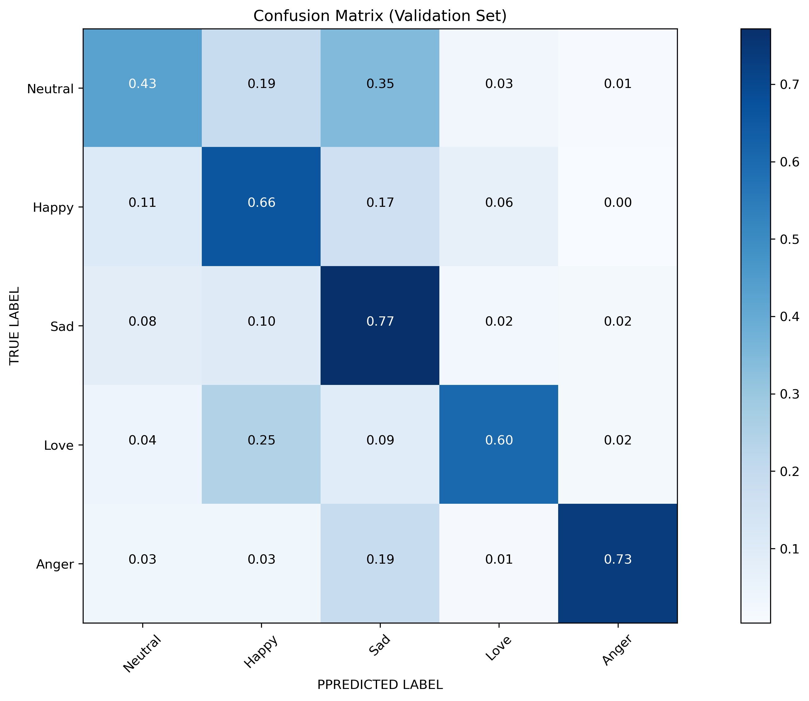

# Multi-Class Text Emotion Analysis
Text-Emotion-Analysis is a project to develop rule-based and deep learning algorithms with an aim to first appropriately detect the different types of emotions contained in a collection of English sentences or a large paragraph and then accurately predict the overall emotion of the paragraph. 

The training and validation dataset is comprised of 55,774 tweets from Twitter with labelled emotions of five classes: <b>Neutral, Happy, Sad, Love, Anger</b>.

I have achieved a positive result by achieving more than <b>65%</b> overall classification accuracy and precision.

### Predictions:

